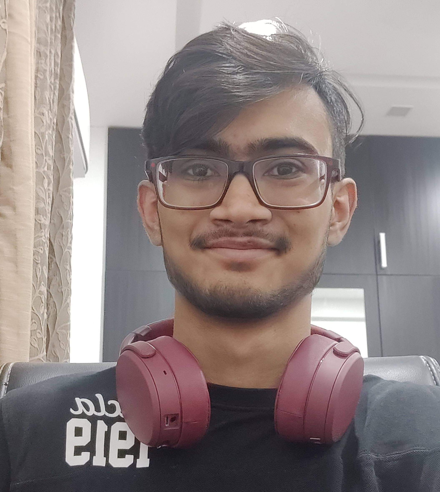

# About Me
My Name is [Navya Sharma](https://www.linkedin.com/in/navya-sharma-33239160/). I currently studying _Computer Engineering_ at the **University of California San Diego**.

## Goals

***I want to become a Lead Software Engineer at a Quantitative Hedge Fund.***
In order to achieve this I want to pursue a Masters Degree at Oxford in either Computer Science or Physics.

I also want to win the cricket tournament as part of the UCSD Cricket team, and am highly interested in travelling the world as I grow older.

## Work Experience

1. TUTOR, University of California-San Diego (Jan 21  - Current)
Worked under Prof. Christine Alvarado and Prof. Greg Miranda to tutor the introductory CSE courses (CSE8B and CSE11) at UCSD. My job involved holding regular meetings with the students, clearing their doubts and also grade their performance.

2. FULL STACK FLUTTER DEVELOPER, SOCIALIZER (May 21 - Sept 21)
Worked as the lead Full stack Flutter developer to develop the required app which involved high proficiency with data structures and algorithms and database management.

## Accoplishments and Projects

- Research
    
    Developed an AI software for a UAV drone using MATLAB to optimize the energy usage of the drone, which received an impact factor of 5.87 on JETIR. 
- Clubs
    
    Member of the Entrepreneurs Club and Emerging Leaders Program (2019-20).
- Stock Price Predictor
    
    Used stock data (OHLC) from Kaggle to calculate various Indicators (MAs, RSI) and applied Prophet regressor to predict closing prices from historical data. Used backtesting to simulate trading and test the strategy.
- Todo App
    
    Created a flutter based Todo app with Firebase integration to allow email Sign in and registration. Used FutureBuilder and Streams of data to update widgets on the go.

## Hobbies

I love play outdoor sports like Football and Cricket and am also part of UCSD Cricket Team.

## Life Rules

- [] Learn a lot
- [] Always go for the top
- [] Work hard, play hard
- [] Make boatloads of money
- [] Give back to my family
- [] Give back to the world
- [] Win the Nobel Prize in Physics

### My Dad
> Dream and live dream and it will become reality one day. Be the most powerful mind magnet.

### Code to live by 

~~~python
while (alive):
    eat(toSatisfaction = true)
    exercise(toHealth = true)
    play(toRelax = true)
    code(toMakeMoney = true)
~~~